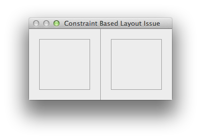
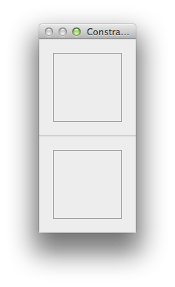
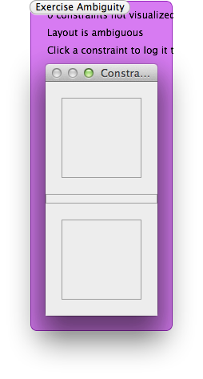

# Summary

Setting a constraint on a view’s size and later updating the constraints does not clear the size constraint.

# Steps to Reproduce

Compile and run [`main.mm`](main.mm):

    clang++ -fobjc-arc -framework Cocoa -o /tmp/main.exe main.mm
    /tmp/main.exe

After running the program it will show a window with two boxes separated by a divider line:

The essential part of the layout is the following line:

    H:|-[left(==100)]-[divider(==1)]-[right(==100)]-|

Now click the window to flip the layout, so instead we use:

    V:|-[left(==100)]-[divider(==1)]-[right(==100)]-|

# Expected Result

The window shows the two boxes stacked vertically, with the one point divider to separate them, as shown here:

# Actual Result

Ambiguity warning:

    constraint.exe: Unable to simultaneously satisfy constraints:
    (
        "<NSLayoutConstraint:0x7fe7c9409860 V:[NSBox:0x7fe7c842d7c0'Title'(1)]>",
        "<NSAutoresizingMaskLayoutConstraint:0x7fe7cb10cc40 h=-&- v=-&- V:|-(6)-[NSView:0x7fe7c842dc60]   (Names: '|':NSBox:0x7fe7c842d7c0'Title' )>",
        "<NSAutoresizingMaskLayoutConstraint:0x7fe7cb10cbe0 h=-&- v=-&- V:[NSView:0x7fe7c842dc60]-(6)-|   (Names: '|':NSBox:0x7fe7c842d7c0'Title' )>"
    )
    
    Will attempt to recover by breaking constraint 
    <NSLayoutConstraint:0x7fe7c9409860 V:[NSBox:0x7fe7c842d7c0'Title'(1)]>
    
    Set the NSUserDefault NSConstraintBasedLayoutVisualizeMutuallyExclusiveConstraints to YES to have -[NSWindow visualizeConstraints:] automatically called when this happens.  And/or, break on objc_exception_throw to catch this in the debugger.

Enabling `NSConstraintBasedLayoutVisualizeMutuallyExclusiveConstraints` visualizes the issue like this:

# Notes

Starting the layout as vertical, and then going to horizontal mode will show the same issue, but when the layout is horizontal.

Removing the constraint that the divider should be 1 point fixes the issue (but then the layout is not as desired).

Sending `setNeedsUpdateConstraints:` with `YES` to the divider view does not fix the issue. The only workaround I have found is to recreate the divider view (before updating the constraints).
